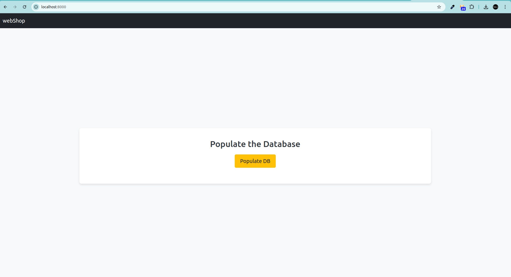

# webshop
### Name: Muhammad Hamza Rehman
### Email: hamza.m.rehman@abo.fi

### All the Mandatory and optional requirements have been implemented in this project. 

## Setup Instructions

1. Clone the Repository
   Clone the project repository to your local machine:

   ```bash
     git clone <repository-url>
     cd <project-directory>
    ```
2. Create a Virtual Environment
   Run the following command to create a virtual environment:
   ```bash
    python3 -m venv venv
    ```
3. Activate the virtual environment:
    ```bash
    source venv/bin/activate
    ```
## Start the backend server
### Requirements

Before running the project, ensure you have the following installed:

* Python 3.10
* Django (5.0.4)
* Django REST Framework
* Pip (Python package installer)
* Virtualenv 

1. Install Dependencies:
    ```bash
    pip install -r requirements.txt
    ```
2. Move to backend directory ```cd backend/webshop``` and create new db file ```touch db.sqlite3```

3. Run Migrations:
   Run the following command to apply the migrations and create the necessary database tables:
    ```bash
    python manage.py migrate
    ```
4. Run the Project:
    ```bash
    python manage.py runserver
    ```
    The project will be available at:

    ```bash
    http://127.0.0.1:8000/
    ```
    

## Now let's run the frontend:

### Requirements

Before running the project, ensure you have the following installed:

* Node.js (v20 or later recommended)
* npm.

Now move to front-end directory ```cd frontend```

### Install Dependencies

* Once inside the project directory, install the required Node.js packages using npm
    ```bash
        npm install
    ```
### Run the development server:

```bash
npm run dev

```
Open [http://localhost:3000](http://localhost:3000) with your browser to see the result.
